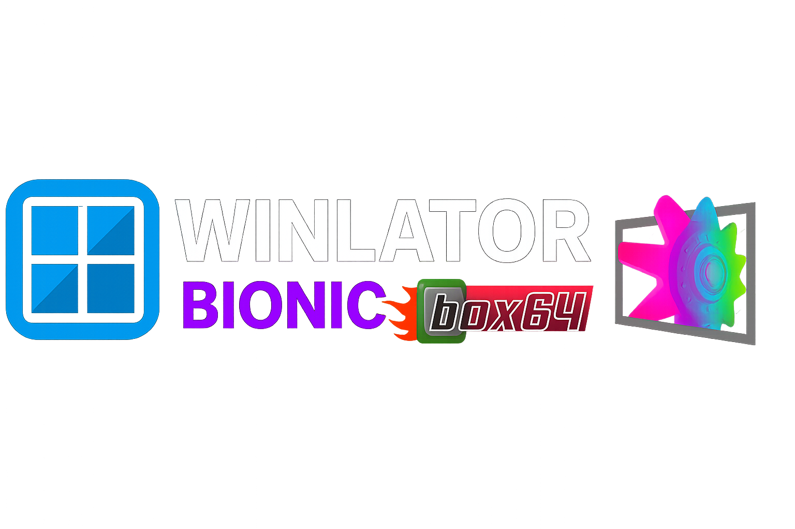

<p align="center">
  
</p>

<h1 align="center">Winlator Ludashi Console</h1>

<p align="center">
  <strong>0.1.0-beta</strong> — a Switch-inspired Console UI on the Ludashi / Bionic Winlator stack
</p>

<p align="center">
  <a href="https://github.com/StevenMXZ/Winlator-Ludashi"></a>
  <a href="LICENSE"></a>
  <a href="CREDITS.md"></a>
  
  
</p>

---

## What is this?

**Winlator** lets you run Windows (x86 / x86_64) apps and games on Android via Wine, Box64 / FEXCore, and a containerized rootfs.

This repository ships a **Console 0.1.0-beta** experience on top of **[StevenMXZ’s Winlator-Ludashi](https://github.com/StevenMXZ/Winlator-Ludashi)** (itself descended from **Pipetto-crypto’s Winlator Bionic** and **BrunoSX’s original Winlator**):

- Game library home with soft system chrome  
- System side panel (Library, Containers, Files, Control panel, Settings, About)  
- Modern container create / edit (General · Environment · Advanced · Components)  
- Edge gestures, tab pager, sheet dismiss — finger-follow motion  
- Optional Hive Agent (OpenAI-compatible / OpenRouter) helpers  
- Delta chassis / on-screen control editing  

> **Beta:** expect rough edges. Please file issues with device model, Android version, and logs.

---

## Credits first

**Full credit to the people who made Winlator possible:**

- **BrunoSX (brunodev85)** — original [Winlator](https://github.com/brunodev85/winlator)  
- **Pipetto-crypto** — [Winlator Bionic](https://github.com/Pipetto-crypto/winlator)  
- **Steven (StevenMXZ)** — [Winlator-Ludashi](https://github.com/StevenMXZ/Winlator-Ludashi) packaging, contents, and maintenance  

Plus Wine, Box64, FEX-Emu, Mesa, DXVK, VKD3D, PRoot, AdrenoTools, and the wider community — see **[CREDITS.md](CREDITS.md)** and **[NOTICE](NOTICE)**.

This beta does **not** claim ownership of upstream Winlator. It is a derivative UI / packaging effort.

---

## Install (beta)

1. Open **[Releases](../../releases)** and download the latest **`0.1.0-beta`** CI APK (`*-debug.apk` or release asset name from the workflow).  
2. Install on an **arm64-v8a** Android device (min SDK 26; target SDK 28 as upstream).  
3. First launch may unpack ImageFS / container assets — wait for setup to finish.  
4. Add a game from the library (**+**) or System → Files, then play from the shelf.

Package id (this tree): `com.winlator.cmod`.

### Ludashi / Vanilla / RedMagic note

Steven’s upstream documents alternate package-id builds (Ludashi benchmark mimic, vanilla, RedMagic). This Console beta currently tracks the **vanilla-style** `com.winlator.cmod` application id in-tree. See upstream README for those packaging variants.

---

## Build from source

```bash
git clone --recurse-submodules <this-repo-url>
cd Winlator-Ludashi   # or your clone name

# Native Adreno tooling (same approach as upstream CI)
# The GitHub Actions workflow clones libadrenotools + linkernsbypass for you.

chmod +x gradlew
./gradlew :app:assembleDebug
```

APK output:

`app/build/outputs/apk/debug/app-debug.apk`

Large assets (`imagefs.tar.zst`, `proton-9.0-arm64ec.tar.zst`) are fetched by the Gradle `preBuild` download tasks when missing — do **not** commit those blobs.

Requirements: JDK **17**, Android SDK / NDK as in `app/build.gradle`, `glslang` for shader compile on CI.

---

## Console UI highlights

| Area | Behavior |
|------|----------|
| Library | Shelf of games, long-press options, System hint / edge swipe |
| System menu | Containers, Files, Control panel, Settings, About |
| Gestures | Edge open / back, drawer drag, editor tab swipe, sheet pull-down |
| Containers | List + full editor tabs with continuous scroll |
| Session | In-game Console session menus (where enabled) |
| AI | Optional Hive Agent FAB (configure under Settings) |

---

## Continuous integration

GitHub Actions workflow **`.github/workflows/release.yml`**:

- Builds `assembleDebug` on Ubuntu with JDK 17  
- Clones Adreno native deps like upstream  
- Uploads the APK as a workflow artifact  
- On version tags (`v0.1.0-beta`, etc.), publishes a **GitHub Release** with the APK attached  

Push a tag to cut a release:

```bash
git tag -a v0.1.0-beta -m "Winlator Ludashi Console 0.1.0-beta"
git push origin v0.1.0-beta
```

---

## Useful tips (from upstream)

- Box64 **Performance** preset can help on x86_64 containers  
- Try alternate **FEXCore** versions on Arm64EC containers  
- Wine Mono from Start Menu → System Tools for many .NET apps  
- `MESA_EXTENSION_MAX_YEAR=2003` can help some older OpenGL titles  
- Contents / drivers: [StevenMXZ/Winlator-Contents](https://github.com/StevenMXZ/Winlator-Contents), [AdrenoToolsDrivers](https://github.com/K11MCH1/AdrenoToolsDrivers)  
- Community tutorial (ZeroKimchi): https://youtu.be/EJDWZUGF9sk  

---

## License

MIT for the application sources covered by `LICENSE`, with copyright attributed to **BrunoSX** and subsequent fork maintainers including **StevenMXZ**. Third-party native stacks keep their own licenses — see `NOTICE`.

---

## Disclaimer

Windows software compatibility varies widely. This project is **unofficial**, provided as-is, with **no warranty**. Respect the licenses of Windows applications you run and of all bundled open-source components.
